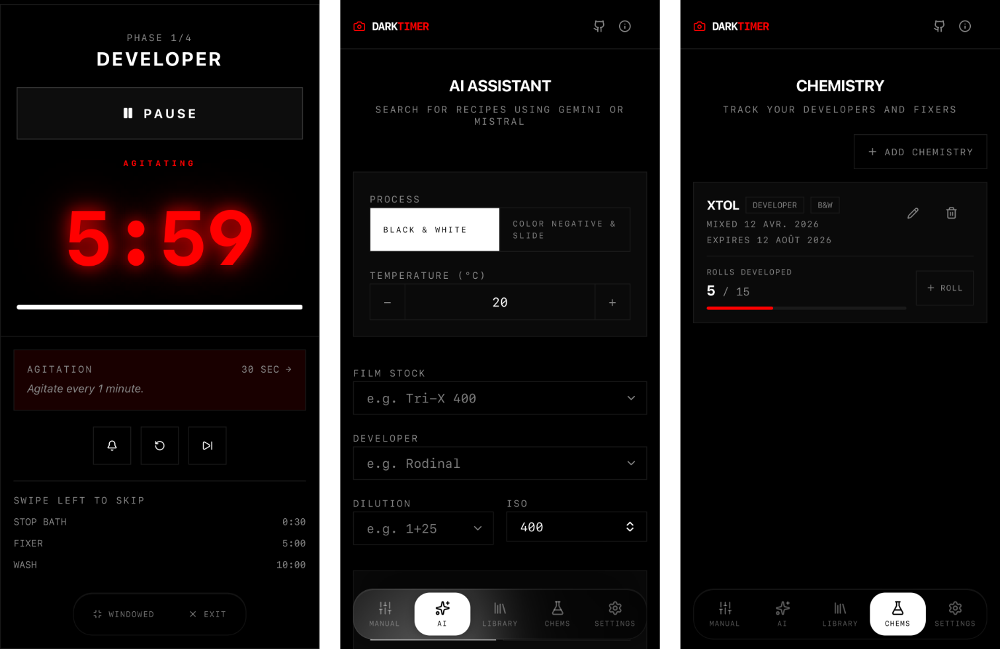

# DarkTimer

A utilitarian darkroom timer for analog film development. Look up development recipes via AI, build custom multi-phase workflows, and run guided timers with agitation cues — all in a minimal dark-mode interface built for mobile and desktop.

**[Live demo → darktimer.vercel.app](https://darktimer.vercel.app)**

---



---

## Features

### Interactive Timer
Guided multi-phase countdown with:
- **Agitation alerts** — visual (red flash overlay), audio (440 Hz beep), and vibration cues at each agitation cycle
- **Phase-end audio** — 880 Hz beep when a phase completes; timer pauses before advancing
- **Per-phase countdown** — configurable 0 / 5 / 10 s delay before each phase starts, with descending audio beeps
- **Yolo Run** — auto-advances to the next phase without any manual tap, for hands-off workflows
- **Developer reuse compensation** — adds extra development time based on a fixed percentage (custom or auto-calculated from your Chems log)
- **Web Notifications** — optional browser notifications for agitation and phase-end events
- **Fullscreen / immersive mode** — Web Fullscreen API on desktop, immersive fallback on mobile, native window fullscreen in the Tauri desktop app
- **Wake lock** — keeps the screen on during an active session
- **Session resumption** — interrupted sessions are saved and can be picked up exactly where you left off
- Controls: Start / Pause, Reset phase, Skip phase, Mute audio

### AI Recipe Finder
Query development times for any film/developer combination using **Gemini** or **Mistral**. The AI cross-references published data (including the Massive Dev Chart) and returns up to three recipe options with phases, temperatures, and notes. Results are cached and automatically saved to your Library. Supports pull-to-refresh on mobile.

### Manual Recipe Builder
Build fully custom multi-phase development workflows from scratch:
- Searchable film stock, developer, and dilution dropdowns
- ISO selector, temperature input, and process mode toggle (**B&W** vs **Color / Slide**)
- Add, remove, and reorder phases (Developer, Stop Bath, Fixer, Wash, Blix, or anything custom) with per-phase name, duration, and agitation mode

### Recipe Library
Save and reuse your development presets locally. One tap to jump straight into a timer session. Full create / edit / delete support with presets stored in IndexedDB.

### Session History
Every timer run is recorded with start/end time, total duration, phases completed, compensation applied, and a status badge (Completed / Partial / Aborted). Expandable cards show the full recipe snapshot for each session.

### Chemistry Tracker (Chems)
Log your developer and fixer batches with mix date, expiration date, max rolls, and a live roll counter:
- **Warnings** when a batch approaches capacity or expiration (within 7 days)
- **Auto-track** — automatically increments the matching developer's roll count after each completed session
- **Auto compensation** — developer reuse compensation reads roll count directly from the matched Chems entry

### Settings
- Default phase durations for B&W and Color / Slide process modes
- AI provider selection (Gemini / Mistral) and API key management — keys are stored only in your browser, never sent to a server. Choose between session-only storage or AES-encrypted persistent storage with a passphrase
- Notifications toggle (requires browser permission)
- Agitation flash overlay and vibration toggles
- Phase countdown duration (0 / 5 / 10 s)
- Yolo Run toggle
- Auto-track chem rolls toggle
- Clear history / factory reset

---

## Stack

React 19 · Vite 6 · TypeScript · Tailwind CSS v4 · Framer Motion · Tauri v2

---

## Getting Started

**Prerequisites:** Node.js 18+, plus a [Gemini API key](https://aistudio.google.com/apikey) or [Mistral API key](https://console.mistral.ai/api-keys/)

```bash
npm install
npm run dev
```

Open [localhost:3000](http://localhost:3000), go to **Settings**, choose your preferred AI provider, and paste your API key to enable the AI Assistant. No `.env` file needed — keys are stored in your browser.

### Desktop app (Tauri)

**Additional prerequisite:** [Rust](https://rustup.rs)

```bash
npm run tauri:dev      # development
npm run tauri:build    # package for distribution
```

### PWA

DarkTimer can be installed as a Progressive Web App on iOS Safari, Android Chrome, and desktop Chrome. An install prompt appears automatically on supported platforms.

---

## License

MIT — see [LICENSE](LICENSE)
